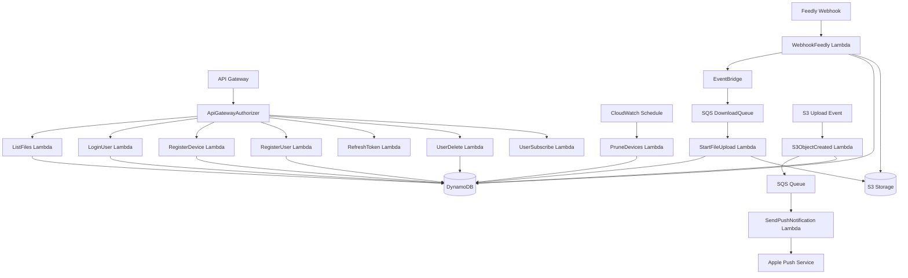
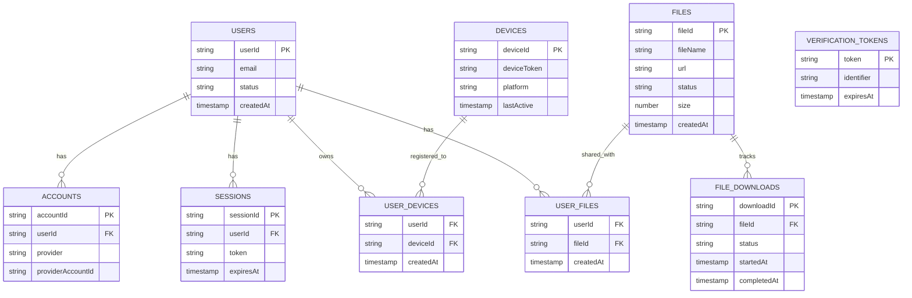

# Project Context for AI Agents

## Convention Capture System

**CRITICAL**: This project captures emergent conventions during development. Read `docs/wiki/Meta/Conventions-Tracking.md` at session start.

### Detection Signals:
- 🚨 **CRITICAL**: "NEVER", "FORBIDDEN", "Zero-tolerance"
- ⚠️ **HIGH**: "MUST", "REQUIRED", "ALWAYS"
- 📋 **MEDIUM**: "Prefer X over Y", repeated decisions

### When Convention Detected:
1. Update `docs/wiki/Meta/Conventions-Tracking.md` with the new convention
2. Document in appropriate wiki page under `docs/wiki/`
3. Mark as documented in tracking file

### Reference:
- **Active Conventions**: `docs/wiki/Meta/Conventions-Tracking.md`
- **Documentation Guide**: `docs/wiki/Meta/Convention-Capture-System.md`

**Philosophy**: Current state documented in wiki. History lives in git/PRs. No duplicate documentation.

---

## Project Overview

AWS Serverless media downloader service built with OpenTofu and TypeScript. Downloads media content (primarily YouTube videos) and integrates with a companion iOS app for offline playback. Created as a cost-effective alternative to YouTube Premium's offline playback feature.

### Architecture
- **Infrastructure**: OpenTofu (IaC)
- **Runtime**: AWS Lambda (Node.js 22.x)
- **Language**: TypeScript
- **Storage**: Amazon S3
- **API**: AWS API Gateway with custom authorizer
- **Notifications**: Apple Push Notification Service (APNS)
- **Database**: DynamoDB with ElectroDB ORM (single-table design)
- **Monitoring**: CloudWatch, X-Ray (optional)

### Project Structure
```
.
├── terraform/             # AWS Infrastructure definitions (OpenTofu)
├── src/
│   ├── entities/          # ElectroDB entity definitions (single-table design)
│   │   ├── Collections.ts # Service combining entities for JOIN-like queries
│   │   ├── Files.ts       # File entity
│   │   ├── FileDownloads.ts # Download tracking entity
│   │   ├── Users.ts       # User entity
│   │   ├── Devices.ts     # Device entity
│   │   ├── UserFiles.ts   # User-File relationships
│   │   ├── UserDevices.ts # User-Device relationships
│   │   ├── Sessions.ts    # Better Auth session entity
│   │   ├── Accounts.ts    # Better Auth OAuth account entity
│   │   └── VerificationTokens.ts # Better Auth verification tokens
│   ├── lambdas/           # Lambda functions (each subdirectory = one Lambda)
│   │   └── [lambda-name]/
│   │       ├── src/index.ts         # Lambda handler
│   │       └── test/index.test.ts   # Unit tests
│   ├── lib/vendor/        # 3rd party API wrappers & AWS SDK encapsulation
│   │   ├── AWS/           # AWS SDK vendor wrappers (src/lib/vendor/AWS/)
│   │   ├── BetterAuth/    # Better Auth configuration & ElectroDB adapter
│   │   ├── ElectroDB/     # ElectroDB configuration & service
│   │   └── YouTube.ts     # YouTube/yt-dlp wrapper
│   └── mcp/               # Model Context Protocol server & validation
│       ├── server.ts      # MCP server entry point
│       ├── handlers/      # Query tools (entities, lambda, infrastructure, etc.)
│       └── validation/    # AST-based convention enforcement (13 rules)
├── test/helpers/          # Test utilities
│   └── electrodb-mock.ts  # ElectroDB mock helper for unit tests
├── types/                 # TypeScript type definitions
├── util/                  # Shared utility functions
├── docs/
│   ├── wiki/              # All documentation and style guides
│   └── conventions-tracking.md  # Project-specific conventions
└── build/graph.json       # Code graph (ts-morph) - READ THIS
```

## System Architecture

### Lambda Data Flow



### Entity Relationship Model



### Service Interaction Map

```
┌─────────────────────────────────────────────────────────────┐
│                        API Gateway                          │
│                    (Custom Authorizer)                      │
└────────────┬────────────────────────────────────┬───────────┘
             │                                    │
             ▼                                    ▼
┌─────────────────────┐              ┌─────────────────────┐
│   Lambda Functions  │              │   External Services │
├─────────────────────┤              ├─────────────────────┤
│ • ListFiles         │              │ • Feedly API        │
│ • LoginUser         │              │ • YouTube (yt-dlp)  │
│ • RegisterDevice    │              │ • APNS              │
│ • StartFileUpload   │              │ • Sign In w/ Apple  │
│ • WebhookFeedly     │              │ • GitHub API        │
└──────────┬──────────┘              └─────────────────────┘
           │
           ▼
┌─────────────────────────────────────────────────────────────┐
│                     AWS Services Layer                      │
├─────────────────────┬───────────────┬──────────────────────┤
│    DynamoDB         │      S3       │    CloudWatch        │
│  (ElectroDB ORM)    │  (Media Files)│   (Logs/Metrics)     │
└─────────────────────┴───────────────┴──────────────────────┘
```

### Dependency Analysis with graph.json

The `build/graph.json` file contains comprehensive dependency information. Key queries:

```bash
# Get all transitive dependencies for a Lambda function
cat build/graph.json | jq '.transitiveDependencies["src/lambdas/ListFiles/src/index.ts"]'

# Find all files that import a specific module
cat build/graph.json | jq '.files | to_entries[] | select(.value.imports[]? | contains("entities/Files")) | .key'

# List all Lambda entry points
cat build/graph.json | jq '.files | keys[] | select(contains("src/lambdas") and contains("/src/index.ts"))'

# Get import count for complexity analysis
cat build/graph.json | jq '.files | to_entries | map({file: .key, importCount: (.value.imports | length)}) | sort_by(.importCount) | reverse[:10]'
```

### Keeping MCP & GraphRAG in Sync

The MCP server (`src/mcp/`) and GraphRAG (`graphrag/`) use shared data sources for accuracy:

| Data Source | Purpose | Auto-Updated |
|-------------|---------|--------------|
| `src/lambdas/` | Lambda discovery | ✓ Filesystem scan |
| `src/entities/` | Entity discovery | ✓ Filesystem scan |
| `build/graph.json` | Dependencies | ✓ Generated before build |
| `graphrag/metadata.json` | Semantic info | ✗ Manual updates required |

**When adding/removing Lambdas or Entities:**
1. The MCP handlers and GraphRAG auto-discover from filesystem
2. Update `graphrag/metadata.json` with trigger types and purposes
3. Run `pnpm run graphrag:extract` to regenerate the knowledge graph
4. CI will fail if `knowledge-graph.json` is out of date

**When changing Lambda invocation chains:**
1. Update `graphrag/metadata.json` `lambdaInvocations` array
2. Run `pnpm run graphrag:extract`

### Lambda Trigger Patterns

| Lambda | Trigger Type | Source | Purpose |
|--------|-------------|--------|---------|
| ApiGatewayAuthorizer | API Gateway | All authenticated routes | Authorize API requests via Better Auth |
| CloudfrontMiddleware | CloudFront | Edge requests | Edge processing for CDN |
| ListFiles | API Gateway | GET /files | List user's available files |
| LogClientEvent | API Gateway | POST /events | Log client-side events |
| LoginUser | API Gateway | POST /auth/login | Authenticate user |
| PruneDevices | CloudWatch Events | Daily schedule | Clean inactive devices |
| RefreshToken | API Gateway | POST /auth/refresh | Refresh authentication token |
| RegisterDevice | API Gateway | POST /devices | Register iOS device for push |
| RegisterUser | API Gateway | POST /auth/register | Register new user |
| S3ObjectCreated | S3 Event | s3:ObjectCreated | Handle uploaded files, notify users |
| SendPushNotification | SQS | S3ObjectCreated | Send APNS notifications |
| StartFileUpload | SQS | DownloadQueue (via EventBridge) | Download video from YouTube to S3 |
| UserDelete | API Gateway | DELETE /users | Delete user and cascade |
| UserSubscribe | API Gateway | POST /subscriptions | Manage user topic subscriptions |
| WebhookFeedly | API Gateway | POST /webhooks/feedly | Process Feedly articles, publish events |

### Data Access Patterns

| Pattern | Entity | Access Method | Index Used |
|---------|--------|--------------|------------|
| User's files | UserFiles → Files | Query by userId | GSI1 |
| User's devices | UserDevices → Devices | Query by userId | GSI1 |
| File's users | UserFiles | Query by fileId | GSI2 |
| Device lookup | Devices | Get by deviceId | Primary |
| User resources | Collections.userResources | Batch query | GSI1 |

## Critical Project-Specific Rules

1. **Use build/graph.json for dependency analysis**:
   - Auto-generated before every build
   - Shows file-level imports and transitive dependencies
   - **CRITICAL for Jest tests**: Use `transitiveDependencies` to find all mocks needed
   - Example: `cat build/graph.json | jq '.transitiveDependencies["src/lambdas/WebhookFeedly/src/index.ts"]'`
2. **pnpm lifecycle script protection** (security hardening):
   - All lifecycle scripts disabled by default in `.npmrc`
   - Protects against AI-targeted typosquatting and supply chain attacks
   - Scripts blocked during installation - must explicitly allowlist packages
   - If package requires install scripts, audit code first then add to `.npmrc`
3. **Feedly webhook** uses query-based authentication (custom authorizer)
4. **APNS certificates** required for iOS push notifications (p12 format)
5. **YouTube downloads** require cookie authentication due to bot detection
6. **LocalStack integration** for local AWS testing via vendor wrappers
7. **Webpack externals** must be updated when adding AWS SDK packages

## ElectroDB Architecture

**CRITICAL**: This project uses ElectroDB as the DynamoDB ORM for type-safe, maintainable database operations.

### Key ElectroDB Features
- **Single-table design**: All entities in one DynamoDB table with optimized GSIs
- **Type-safe queries**: Full TypeScript type inference for all operations
- **Collections**: JOIN-like queries across entity boundaries (see `src/entities/Collections.ts`)
- **Batch operations**: Efficient bulk reads/writes with automatic chunking

### Entity Relationships
- **Users** ↔ **Files**: Many-to-many via UserFiles entity
- **Users** ↔ **Devices**: Many-to-many via UserDevices entity
- **Users** ↔ **Sessions**: One-to-many (Better Auth sessions)
- **Users** ↔ **Accounts**: One-to-many (Better Auth OAuth accounts)
- **Files** ↔ **FileDownloads**: One-to-many (download tracking)

### Collections (JOIN-like Queries)
- **Collections.userResources**: Query all files & devices for a user in one call
- **Collections.fileUsers**: Get all users associated with a file (for notifications)
- **Collections.deviceUsers**: Get all users associated with a device (for cleanup)
- **Collections.userSessions**: Get all sessions for a user (Better Auth)
- **Collections.userAccounts**: Get all OAuth accounts for a user (Better Auth)

### Testing with ElectroDB
- **ALWAYS** use `test/helpers/electrodb-mock.ts` for mocking entities
- **NEVER** create manual mocks for ElectroDB entities
- See test style guide for detailed mocking patterns

## Wiki Conventions to Follow

**BEFORE WRITING ANY CODE, READ THE APPLICABLE GUIDE:**

### Core Conventions
- **Git Workflow**: [docs/wiki/Conventions/Git-Workflow.md](docs/wiki/Conventions/Git-Workflow.md) - NO AI attribution in commits
- **Naming**: [docs/wiki/Conventions/Naming-Conventions.md](docs/wiki/Conventions/Naming-Conventions.md) - camelCase, PascalCase rules
- **Comments**: [docs/wiki/Conventions/Code-Comments.md](docs/wiki/Conventions/Code-Comments.md) - Git as source of truth

### TypeScript & Testing
- **Lambda Patterns**: [docs/wiki/TypeScript/Lambda-Function-Patterns.md](docs/wiki/TypeScript/Lambda-Function-Patterns.md)
- **Jest Mocking**: [docs/wiki/Testing/Jest-ESM-Mocking-Strategy.md](docs/wiki/Testing/Jest-ESM-Mocking-Strategy.md)
- **Mock Types**: [docs/wiki/Testing/Mock-Type-Annotations.md](docs/wiki/Testing/Mock-Type-Annotations.md)
- **Coverage Philosophy**: [docs/wiki/Testing/Coverage-Philosophy.md](docs/wiki/Testing/Coverage-Philosophy.md)
- **Integration Testing**: [docs/wiki/Integration/LocalStack-Testing.md](docs/wiki/Integration/LocalStack-Testing.md)

### AWS & Infrastructure
- **Vendor Encapsulation**: [docs/wiki/Conventions/Vendor-Encapsulation-Policy.md](docs/wiki/Conventions/Vendor-Encapsulation-Policy.md) - ZERO tolerance
- **Bash Scripts**: [docs/wiki/Bash/Script-Patterns.md](docs/wiki/Bash/Script-Patterns.md)
- **OpenTofu/Terraform**: [docs/wiki/Infrastructure/OpenTofu-Patterns.md](docs/wiki/Infrastructure/OpenTofu-Patterns.md)

## Anti-Patterns to Avoid

The following patterns have caused issues in this project and should be avoided:

### 1. Direct Vendor Library Imports (CRITICAL)
**Wrong**: `import {DynamoDBClient} from '@aws-sdk/client-dynamodb'`
**Right**: `import {getDynamoDBClient} from '#lib/vendor/AWS/DynamoDB'`
**Why**: Breaks encapsulation, makes testing difficult, loses environment detection (LocalStack/X-Ray)
**Applies to**: AWS SDK, ElectroDB, Better Auth, yt-dlp, and all third-party services

### 2. Manual ElectroDB Entity Mocks (CRITICAL)
**Wrong**: Hand-crafted mock objects for entities in tests
**Right**: `const mock = createElectroDBEntityMock({queryIndexes: ['byUser']})`
**Why**: Inconsistent mocking leads to false positives and maintenance burden

### 3. Promise.all for Cascade Deletions (CRITICAL)
**Wrong**: `await Promise.all([deleteUser(), deleteUserFiles()])`
**Right**: `await Promise.allSettled([deleteUserFiles(), deleteUser()])`
**Why**: Partial failures leave orphaned data; children must be deleted before parents

### 4. Try-Catch for Required Environment Variables (CRITICAL)
**Wrong**: `try { config = JSON.parse(process.env.CONFIG) } catch { return fallback }`
**Right**: `const config = getRequiredEnv('CONFIG')` - let it fail fast
**Why**: Silent failures hide configuration errors that should break at cold start

### 5. Underscore-Prefixed Unused Variables (HIGH)
**Wrong**: `handler(event, _context, _callback)` to suppress warnings
**Right**: `handler({body}: APIGatewayProxyEvent)` - destructure only what you need
**Why**: Backwards-compatibility hacks obscure intent and violate project conventions

### 6. AI Attribution in Commits (CRITICAL)
**Wrong**: Commit messages with "Generated with Claude", emojis, "Co-Authored-By: AI"
**Right**: Clean commit messages following commitlint format: `feat: add new feature`
**Why**: Professional commits, code ownership clarity, industry standard

### 7. Module-Level Environment Variable Validation (HIGH)
**Wrong**: `const config = getRequiredEnv('CONFIG')` at top of module
**Right**: Call `getRequiredEnv()` inside functions (lazy evaluation)
**Why**: Module-level calls break tests that need to set up mocks before import

### 8. Raw Response Objects in Lambdas (HIGH)
**Wrong**: `return {statusCode: 200, body: JSON.stringify(data)}`
**Right**: `return response(200, data)`
**Why**: Inconsistent formatting, missing headers, no type safety

## Type Naming Patterns

| Pattern | Usage | Examples |
|---------|-------|----------|
| Simple nouns | Domain entities | `User`, `File`, `Device`, `Session` |
| `*Item` | ElectroDB parsed types | `UserItem`, `FileItem`, `DeviceItem` |
| `*Input` | Request payloads & mutations | `UserLoginInput`, `CreateFileInput` |
| `*Response` | API response wrappers | `FileResponse`, `LoginResponse` |
| `*Error` | Error classes | `AuthorizationError`, `ValidationError` |

### File Organization (`src/types/`)

| File | Contents |
|------|----------|
| `domain-models.d.ts` | User, File, Device, IdentityProvider |
| `request-types.d.ts` | *Input types for API requests |
| `notification-types.d.ts` | Push notification payloads |
| `persistence-types.d.ts` | Relationship types (UserDevice, UserFile) |
| `infrastructure-types.d.ts` | AWS/API Gateway types |
| `enums.ts` | FileStatus, UserStatus, ResponseStatus |

### Enum Values (PascalCase)

```typescript
// FileStatus values (aligned with iOS)
Queued | Downloading | Downloaded | Failed
```

## Development Workflow

### Essential Commands
```bash
# Build & Check
pnpm run precheck       # TypeScript type checking and lint (run before commits)
pnpm run build          # Build Lambda functions with esbuild
pnpm run format         # Auto-format with dprint (157 char lines)

# Testing
pnpm run test           # Run unit tests

# Local CI (run before pushing)
pnpm run ci:local       # Fast CI checks (~2-3 min, no integration)
pnpm run ci:local:full  # Full CI checks (~5-10 min, with integration)

# Integration testing
pnpm run localstack:start        # Start LocalStack
pnpm run test:integration        # Run integration tests (assumes LocalStack running)

# Remote testing
pnpm run test-remote-list        # Test file listing
pnpm run test-remote-hook        # Test Feedly webhook
pnpm run test-remote-registerDevice  # Test device registration

# Documentation
pnpm run document-source         # Generate TSDoc documentation

# AI Context
pnpm run pack:context    # Pack codebase into repomix-output.xml for context
pnpm run pack:light      # Pack only interfaces and docs
pnpm run index:codebase  # Re-index codebase for semantic search (LanceDB)
pnpm run search:codebase "query" # Search codebase using natural language
pnpm run validate:conventions # Run AST-based convention checks

# Deployment
pnpm run deploy          # Deploy infrastructure with OpenTofu
```

## AI Context Optimization
This repository is optimized for AI agents using:
- **Semantic Memory**: Local vector database (LanceDB) for natural language code search. Run `pnpm run index:codebase` to update.
- **Repomix**: Packed codebase context in `repomix-output.xml`. Run `pnpm run pack:context` to update.
- **Convention Validation**: CI/CD enforcement of rules in `AGENTS.md` via `pnpm run validate:conventions`.
- **Gemini Instructions**: Custom instructions in `.gemini/instructions.md`.

### LLM Context Files

| File | Purpose | Git Status | Generation |
|------|---------|------------|------------|
| `docs/llms.txt` | Curated index for external AI crawlers (GPTBot, Perplexity) | Committed | Manual |
| `docs/llms-full.txt` | Complete docs for AI agents needing full context | Gitignored | `pnpm run generate:llms` |
| `repomix-output.xml` | Full codebase context for local Claude Code sessions | Gitignored | `pnpm run pack:context` |

### Claude Code Context Loading
Claude Code automatically reads `CLAUDE.md` and `AGENTS.md` at session start. For additional codebase context beyond these files, generate and reference the packed context:
```bash
pnpm run pack:context  # Generates repomix-output.xml
```
Then drag `repomix-output.xml` into the Claude Code conversation or copy relevant sections as needed.

### Pre-Commit Checklist
1. Run `pnpm run validate:conventions` - Ensure no rule violations
2. Run `pnpm run precheck` - TypeScript type checking and lint
3. Run `pnpm run format` - Auto-format code
4. Run `pnpm run pack:context` - Update context for other agents
5. Run `pnpm test` - Ensure all tests pass
6. Verify NO AI references in commit message
7. Stage changes: `git add -A`
8. Commit with clean message: `git commit -m "type: description"`
9. **NEVER push automatically** - Wait for user request


## Integration Points

### External Services
- **Feedly**: Webhook-based article processing (query auth)
- **YouTube**: yt-dlp for video downloads (cookie auth required)
- **APNS**: iOS push notifications (requires certificates)
- **Sign In With Apple**: Authentication for iOS app
- **GitHub API**: Automated issue creation for errors

### AWS Services
- **Lambda**: Event-driven compute (all business logic)
- **S3**: Media storage with transfer acceleration
- **DynamoDB**: Single-table design via ElectroDB ORM for all entities
- **API Gateway**: REST endpoints with custom authorizer
- **SNS**: Push notification delivery
- **CloudWatch**: Logging and metrics
- **X-Ray**: Distributed tracing (optional)

## Common Development Tasks

### Adding New Lambda Function
1. Create `src/lambdas/[name]/` directory structure
2. Implement handler in `src/index.ts` with TypeDoc
3. Write tests in `test/index.test.ts` with fixtures
4. Mock ALL transitive dependencies (see Wiki)
5. Define Lambda resource in OpenTofu
6. Verify esbuild discovers new Lambda entry point
7. Configure appropriate IAM permissions
8. Import utilities from `util/` directory

### Debugging Production Issues
1. Check CloudWatch logs for Lambda
2. Review automated GitHub issues
3. Use AWS X-Ray for tracing (if enabled)
4. Test with production-like data locally
5. Use `test-remote-*` scripts for validation

### Updating API Endpoints
1. Modify API Gateway configuration in OpenTofu
2. Update Lambda handler code
3. Adjust custom authorizer if needed
4. Test with `test-remote-*` scripts
5. Update iOS app if contract changes

## Security & Secrets

- **SOPS**: All secrets managed via SOPS (`secrets.encrypted.yaml`)
- **Environment Variables**: Production secrets via Lambda environment
- **APNS Certificates**: P12 format, separate sandbox/production
- **API Tokens**: Query-based for Feedly compatibility
- **Never commit**: secrets.yaml, certificates, .env files

## Performance Considerations

- Lambda memory allocation: Optimize for cold starts
- S3 transfer acceleration: For large media files
- API Gateway caching: Reduce Lambda invocations
- DynamoDB indexes: Query optimization
- Webpack externals: Reduce bundle size

## Support Resources

- **CI/CD**: GitHub Actions with test pipeline
- **Local Testing**: LocalStack for AWS service emulation
- **Documentation**: TSDoc + terraform-docs
- **Error Tracking**: Automated GitHub issue creation
- **Monitoring**: CloudWatch dashboards and alarms

---

**Remember**: Use TodoWrite tool for complex tasks to track progress and ensure thoroughness.