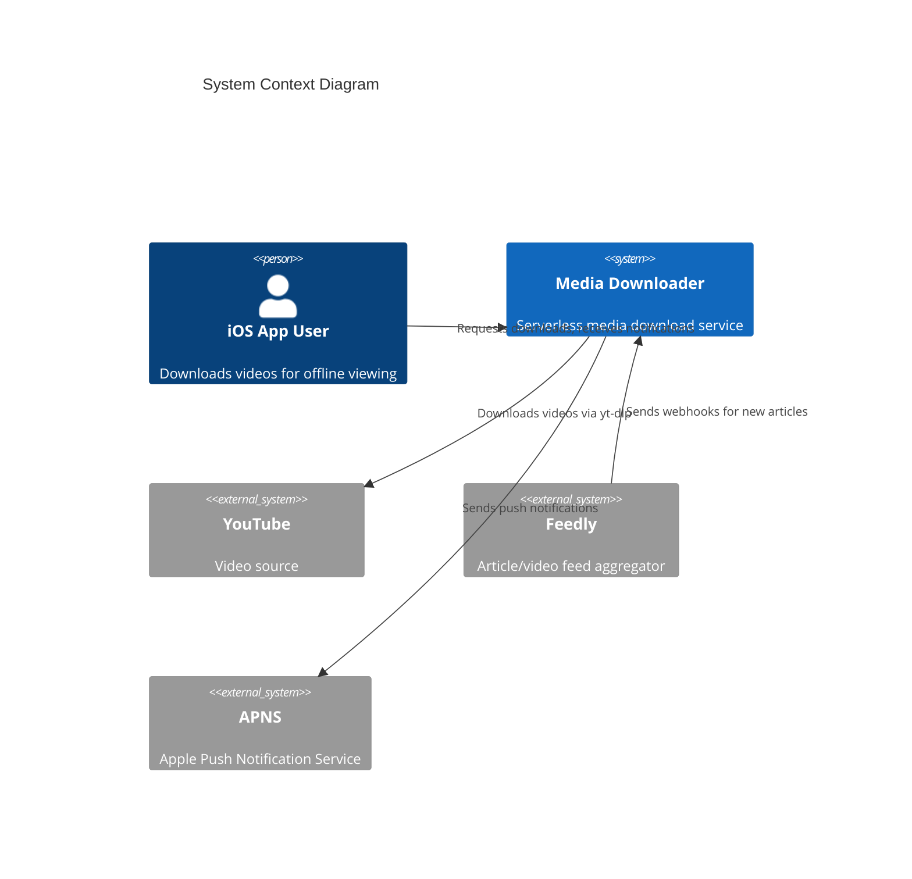
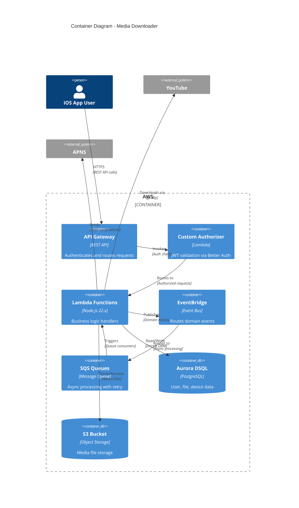

# Architecture Overview

This document provides a 10,000-foot view of the media downloader system architecture, explaining design decisions and their rationale.

## Introduction

The media downloader is a serverless AWS application that downloads YouTube videos for offline playback via a companion iOS app. It was designed as a cost-effective alternative to YouTube Premium's offline feature.

**Architectural Philosophy:**
- Serverless-first for cost optimization and automatic scaling
- Event-driven for decoupling and resilience
- Infrastructure as Code for reproducibility
- Vendor encapsulation for testability and portability

## System Context



## Container Diagram



## Core Architecture Decisions

### 1. AWS Lambda for Compute

**Decision**: Use Lambda functions instead of containers (ECS/Fargate).

**Rationale**:
- Pay-per-request pricing aligns with sporadic download patterns
- Automatic scaling handles burst traffic from Feedly webhooks
- No server management overhead
- Cold starts acceptable for async download processing

**Trade-offs**:
- 15-minute execution limit (mitigated by chunked processing)
- Cold start latency (mitigated by provisioned concurrency for API endpoints)

### 2. Aurora DSQL for Database

**Decision**: Use Aurora DSQL with Drizzle ORM instead of DynamoDB.

**Rationale**:
- Serverless PostgreSQL with automatic scaling
- IAM-based authentication (no password management)
- Type-safe queries via Drizzle ORM
- Relational model fits user/file/device relationships
- No VPC required (reduces Lambda cold start time)

**Trade-offs**:
- Higher per-query cost than DynamoDB
- PostgreSQL learning curve vs NoSQL

### 3. Event-Driven Pipeline

**Decision**: Use EventBridge + SQS for async processing instead of direct Lambda invocation.

**Rationale**:
- Decouples webhook ingestion from download processing
- Built-in retry with exponential backoff
- Dead letter queues for failed messages
- Visibility timeout prevents duplicate processing

**Trade-offs**:
- Added latency (acceptable for async downloads)
- More complex debugging (mitigated by X-Ray tracing)

### 4. Vendor Encapsulation

**Decision**: Wrap all AWS SDK calls in `src/lib/vendor/AWS/` modules.

**Rationale**:
- Enables LocalStack integration testing
- Simplifies mocking in unit tests
- Allows client injection for different environments
- Documents AWS service dependencies explicitly

See [Vendor Encapsulation Policy](../Conventions/Vendor-Encapsulation-Policy.md) for enforcement details.

### 5. Better Auth for Authentication

**Decision**: Use Better Auth instead of Cognito or custom JWT implementation.

**Rationale**:
- Modern TypeScript-first auth library
- PostgreSQL adapter for Aurora DSQL integration
- Built-in Sign In With Apple support
- Session management with automatic refresh

**Trade-offs**:
- Less AWS-native than Cognito
- Requires custom authorizer Lambda

## Request Flow Patterns

### Pattern 1: Authenticated API Request

```
iOS App → API Gateway → Custom Authorizer (JWT validation)
       → Lambda Handler → Aurora DSQL → Response
```

The custom authorizer validates JWT tokens from Better Auth sessions, extracting user ID for downstream Lambda context.

### Pattern 2: Feedly Webhook Processing

```
Feedly → WebhookFeedly Lambda (query auth) → EventBridge
      → SQS Queue → StartFileUpload Lambda → yt-dlp → S3
      → S3 Event → S3ObjectCreated Lambda → Push notification
```

This async pipeline allows immediate webhook acknowledgment while processing downloads in the background.

### Pattern 3: Device Registration

```
iOS App → RegisterDevice Lambda → Aurora DSQL (UserDevices)
       → Store APNS token → Acknowledge registration
```

Device tokens are stored for push notifications when downloads complete.

## Cross-Cutting Concerns

### Authentication & Authorization

| Component | Purpose |
|-----------|---------|
| Better Auth | Session management with PostgreSQL adapter |
| Custom Authorizer | JWT validation at API Gateway |
| Sign In With Apple | OAuth provider for iOS app |
| Device Tokens | APNS tokens for push notifications |

### Observability

| Component | Purpose |
|-----------|---------|
| CloudWatch Logs | Structured JSON logging via AWS Powertools |
| X-Ray Tracing | Optional distributed tracing (environment flag) |
| CloudWatch Alarms | Error rate and latency monitoring |
| GitHub Issues | Automated issue creation for errors |

### Resilience

| Pattern | Implementation |
|---------|----------------|
| Circuit Breakers | System library for external calls |
| Retry with Backoff | Exponential backoff with jitter |
| Dead Letter Queues | Capture failed SQS messages |
| Idempotency | File downloads keyed by URL hash |

## Performance Considerations

| Concern | Strategy |
|---------|----------|
| Lambda Cold Starts | Provisioned concurrency for API endpoints |
| Database Connections | IAM auth (no connection pooling needed) |
| Large File Downloads | S3 Transfer Acceleration |
| Bundle Size | Webpack externals for AWS SDK |

## Cost Architecture

| Component | Pricing Model | Optimization |
|-----------|---------------|--------------|
| Lambda | Per-request + duration | Memory tuning (1024 MB default) |
| Aurora DSQL | On-demand I/O | Prepared statements for hot paths |
| S3 | Storage + transfer | Standard class, lifecycle policies |
| API Gateway | Per-request | Caching for list endpoints |

## Security Architecture

| Layer | Protection |
|-------|------------|
| Network | API Gateway with custom authorizer |
| Authentication | Better Auth with SIWA |
| Authorization | User-scoped data access |
| Secrets | SOPS encryption, Lambda env vars |
| Dependencies | pnpm lifecycle script blocking |

## Development Architecture

### Local Development

```
Developer → LocalStack (AWS emulation) → Docker containers
         → Vitest (unit tests) → Mock layers
```

### CI/CD Pipeline

```
GitHub Push → Actions Workflow → Build + Test
           → OpenTofu Plan → Deploy to AWS
```

## Related Documentation

- [System Diagrams](./System-Diagrams.md) - Visual representations (ERD, Lambda flows)
- [Code Organization](./Code-Organization.md) - Structural rules
- [Domain Layer](./Domain-Layer.md) - Business logic separation
- [Lambda Function Patterns](../TypeScript/Lambda-Function-Patterns.md) - Handler patterns
- [Vendor Encapsulation Policy](../Conventions/Vendor-Encapsulation-Policy.md) - AWS SDK wrapping
- [LocalStack Testing](../Testing/LocalStack-Testing.md) - Local AWS emulation

---

*This document explains the "why" behind architectural decisions. For the "what" (detailed diagrams and data flows), see [System Diagrams](./System-Diagrams.md).*
