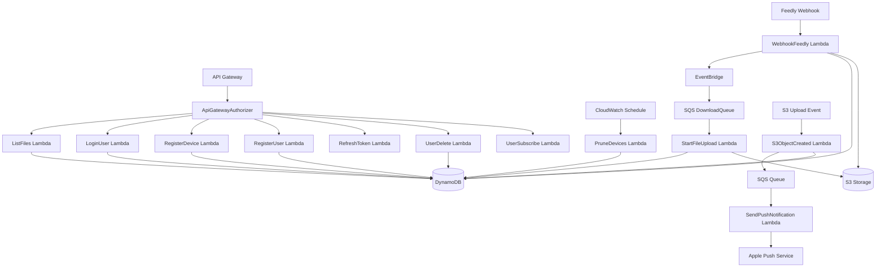
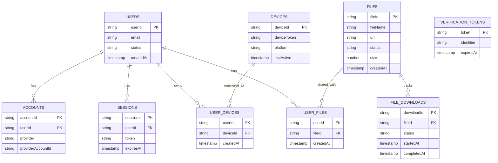

# System Architecture Diagrams

Visual representations of the Media Downloader architecture. For quick reference, see [AGENTS.md](../../../AGENTS.md).

## Lambda Data Flow



## Entity Relationship Model



## Service Interaction Map

```
┌─────────────────────────────────────────────────────────────┐
│                        API Gateway                          │
│                    (Custom Authorizer)                      │
└────────────┬────────────────────────────────────┬───────────┘
             │                                    │
             ▼                                    ▼
┌─────────────────────┐              ┌─────────────────────┐
│   Lambda Functions  │              │   External Services │
├─────────────────────┤              ├─────────────────────┤
│ • ListFiles         │              │ • Feedly API        │
│ • LoginUser         │              │ • YouTube (yt-dlp)  │
│ • RegisterDevice    │              │ • APNS              │
│ • StartFileUpload   │              │ • Sign In w/ Apple  │
│ • WebhookFeedly     │              │ • GitHub API        │
└──────────┬──────────┘              └─────────────────────┘
           │
           ▼
┌─────────────────────────────────────────────────────────────┐
│                     AWS Services Layer                      │
├─────────────────────┬───────────────┬──────────────────────┤
│   Aurora DSQL       │      S3       │    CloudWatch        │
│   (Drizzle ORM)     │  (Media Files)│   (Logs/Metrics)     │
└─────────────────────┴───────────────┴──────────────────────┘
```

## Data Access Patterns

| Pattern | Entity | Access Method | Index Used |
|---------|--------|--------------|------------|
| User's files | UserFiles -> Files | Query by userId | GSI1 |
| User's devices | UserDevices -> Devices | Query by userId | GSI1 |
| File's users | UserFiles | Query by fileId | GSI2 |
| Device lookup | Devices | Get by deviceId | Primary |
| User resources | Collections.userResources | Batch query | GSI1 |

## Lambda Trigger Patterns

| Lambda | Trigger Type | Source | Purpose |
|--------|-------------|--------|---------|
| ApiGatewayAuthorizer | API Gateway | All authenticated routes | Authorize API requests via Better Auth |
| CleanupExpiredRecords | CloudWatch Events | Daily schedule (3 AM UTC) | Clean expired records |
| CloudfrontMiddleware | CloudFront | Edge requests | Edge processing for CDN |
| DeviceEvent | API Gateway | POST /events | Log client-side device events |
| ListFiles | API Gateway | GET /files | List user's available files |
| LoginUser | API Gateway | POST /auth/login | Authenticate user |
| MigrateDSQL | Manual | CLI invocation | Run Drizzle migrations on Aurora DSQL |
| PruneDevices | CloudWatch Events | Daily schedule | Clean inactive devices |
| RefreshToken | API Gateway | POST /auth/refresh | Refresh authentication token |
| RegisterDevice | API Gateway | POST /devices | Register iOS device for push |
| RegisterUser | API Gateway | POST /auth/register | Register new user |
| S3ObjectCreated | S3 Event | s3:ObjectCreated | Handle uploaded files, notify users |
| SendPushNotification | SQS | S3ObjectCreated | Send APNS notifications |
| StartFileUpload | SQS | DownloadQueue (via EventBridge) | Download video from YouTube to S3 |
| UserDelete | API Gateway | DELETE /users | Delete user and cascade |
| UserSubscribe | API Gateway | POST /subscriptions | Manage user topic subscriptions |
| WebhookFeedly | API Gateway | POST /webhooks/feedly | Process Feedly articles, publish events |

---

*These diagrams provide detailed visual context for the Media Downloader architecture. For development guidelines and conventions, see [AGENTS.md](../../../AGENTS.md).*
