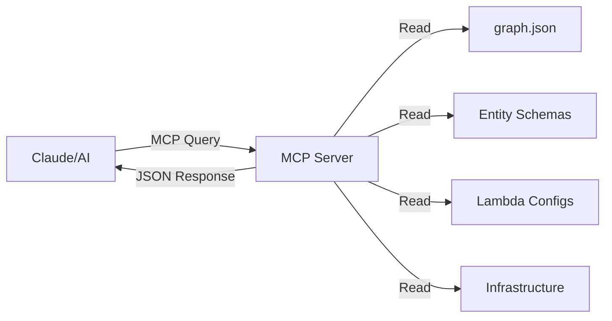

# MCP (Model Context Protocol) Guide

## Overview

The Model Context Protocol (MCP) is an open protocol that standardizes how AI assistants interact with external data sources and tools. For this project, an MCP server is implemented that provides structured, queryable access to the codebase architecture.

## Why MCP?

Traditional approaches to sharing codebase context with AI involve:
- Copying entire files into the conversation (wastes tokens)
- Manually describing architecture (error-prone, gets stale)
- Creating static documentation (requires constant updates)

MCP solves these problems by providing:
- **Dynamic Queries**: AI asks specific questions, gets specific answers
- **Structured Data**: JSON responses instead of parsing code
- **Zero Token Waste**: Only relevant information is returned
- **Always Current**: Queries run against actual codebase state

## How It Works



The MCP server acts as an intelligent API for your codebase, translating high-level queries into structured responses.

## Available Query Types

### 1. Entity Queries
- **Schema**: Get Drizzle ORM entity definitions
- **Relationships**: Understand entity associations
- **Collections**: Learn about JOIN-like queries

### 2. Lambda Queries
- **List**: Get all Lambda functions
- **Config**: Memory, timeout, runtime settings
- **Triggers**: What invokes each Lambda
- **Dependencies**: Libraries and AWS services used
- **Environment**: Required environment variables

### 3. Infrastructure Queries
- **Config**: AWS resource configurations
- **Usage**: Which Lambdas use which resources
- **Dependencies**: Service interdependencies

### 4. Dependency Queries
- **Imports**: Direct file imports
- **Transitive**: All dependencies (for mocking)
- **Dependents**: Who imports a file
- **Circular**: Detect circular dependencies

## Setup Instructions

### 1. Install MCP Server

The MCP server is already installed as part of the project:

```bash
# Verify installation
ls -la src/mcp/server.ts

# Test the server
node --import tsx src/mcp/server.ts
```

### 2. Configure Claude Desktop

Add to `~/Library/Application Support/Claude/claude_desktop_config.json`:

```json
{
  "mcpServers": {
    "media-downloader": {
      "command": "node",
      "args": [
        "--import",
        "tsx",
        "/Users/YOUR_USERNAME/path/to/aws-cloudformation-media-downloader-2/src/mcp/server.ts"
      ]
    }
  }
}
```

### 3. Restart Claude Desktop

After configuration, restart Claude Desktop to load the MCP server.

## Usage Examples

### Example 1: Understanding Data Model

```
User: "What entities are in the database and how are they related?"

Claude uses:
- query_entities({ query: "schema" })
- query_entities({ query: "relationships" })

Response: Structured JSON showing all entities and their relationships
```

### Example 2: Lambda Dependencies for Testing

```
User: "What do I need to mock to test the ListFiles Lambda?"

Claude uses:
- query_dependencies({
    file: "src/lambdas/ListFiles/src/index.ts",
    query: "transitive"
  })

Response: Complete list of all dependencies to mock
```

### Example 3: Infrastructure Analysis

```
User: "Which Lambda functions interact with S3?"

Claude uses:
- query_infrastructure({ resource: "s3", query: "usage" })

Response: List of Lambdas and their S3 operations
```

## Best Practices

### 1. Use MCP for Architecture Questions
Instead of: "Read the Users entity file"
Use: "Query MCP for Users entity schema"

### 2. Combine with File Reading When Needed
- Use MCP to understand structure
- Read specific files only for implementation details

### 3. Leverage Dependency Queries for Testing
- Use transitive dependencies to identify all mocks needed
- Check for circular dependencies before refactoring

### 4. Keep Handlers Updated
When adding new Lambdas or entities:
1. Update the relevant handler in `src/mcp/handlers/`
2. Run tests to ensure consistency
3. Document new query patterns

## Troubleshooting

### MCP Server Not Responding

1. Check server is in config:
```bash
cat ~/Library/Application\ Support/Claude/claude_desktop_config.json | grep media-downloader
```

2. Test server directly:
```bash
node --import tsx src/mcp/server.ts
# Should output: "MCP Server running on stdio"
```

3. Verify dependencies:
```bash
pnpm list @modelcontextprotocol/sdk
```

### Queries Return Errors

1. Ensure graph.json exists:
```bash
pnpm run generate-graph
```

2. Check handler imports:
```bash
node -e "import('./src/mcp/handlers/electrodb.js')"
```

### Claude Not Finding Tools

1. Restart Claude Desktop after config changes
2. Check for typos in tool names
3. Verify server path is absolute, not relative

## Extending the MCP Server

### Adding a New Query Type

1. Define tool in `server.ts`:
```typescript
{
  name: 'query_new_thing',
  description: 'Query new thing',
  inputSchema: { /* ... */ }
}
```

2. Add handler case:
```typescript
case 'query_new_thing':
  return await handleNewThingQuery(args);
```

3. Create handler file:
```typescript
// src/mcp/handlers/newthing.ts
export async function handleNewThingQuery(args: any) {
  // Implementation
}
```

4. Test with inspector:
```bash
npx @modelcontextprotocol/inspector src/mcp/server.ts
```

## Performance Considerations

- **Caching**: MCP server reads from disk on each query (stateless)
- **Graph.json**: Regenerate with `pnpm run generate-graph` after structural changes
- **Response Size**: Large responses may be truncated by Claude
- **Query Optimization**: Use specific queries over "all" when possible

## Security Notes

- MCP server has read-only access to codebase
- No write operations are exposed
- Runs with same permissions as Claude Desktop
- Consider path restrictions in production deployments

## Future Enhancements

Potential improvements to the MCP server:

1. **Caching Layer**: Cache responses for frequently queried data
2. **GraphQL Interface**: More flexible querying
3. **Real-time Updates**: Watch mode for file changes
4. **Metrics**: Track most common queries for optimization
5. **Schema Validation**: Ensure handler responses match expected format

## Related Documentation

- [MCP Specification](https://modelcontextprotocol.io/docs)